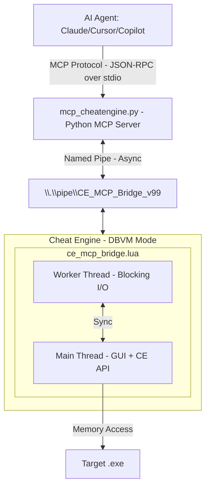

[Demo](https://github.com/user-attachments/assets/a184a006-f569-4b55-858a-ed80a7139035)

# Cheat Engine MCP Bridge

**Let multibillion $ AI datacenters analyze the program memory for you.**

Create mods, trainers, security audits, game bots, accelerate RE, or do anything else with any program and game in a fraction of a time.

[](#) [](https://python.org)

> [!NOTE]
> Thanks everyone for the stars, much appreciated! <3
> 
> Specially a big thank you to all the contributors!!
> 
> [@libangli218](https://github.com/libangli218), [@lauralex](https://github.com/lauralex)

---

## The Problem

You're staring at gigabytes of memory. Millions of addresses. Thousands of functions. Finding *that one pointer*, *that one structure* takes **days or weeks** of manual work.

**What if you could just ask?**

> *"Find the packet decryptor hook."*  
> *"Find the OPcode of character coordinates."*  
> *"Find the OPcode of health values."*  
> *"Find the unique AOB pattern to make my trainer reliable after game updates."*

**That's exactly what this does.**

_- Stop clicking through hex dumps and start having conversations with the memory._

---

## What You Get:

| Before (Manual) | After (AI Agent + MCP) |
|-----------------|---------------------|
| Day 1: Find packet address | Minute 1: "Find RX packet decryption hook" |
| Day 2: Trace what writes to it | Minute 3: "Generate unique AOB signature to make it update persistent" |
| Day 3: Find RX hook | Minute 6: "Find movement OPcodes" |
| Day 4: Document structure | Minute 10: "Create python interpreter of hex to plain text" |
| Day 5: Game updates, start over | **Done.** |

**Your AI can now:**
- Read any memory instantly (integers, floats, strings, pointers)
- Follow pointer chains: `[[base+0x10]+0x20]+0x8` → resolved in ms
- Auto-analyze structures with field types and values
- Identify C++ objects via RTTI: *"This is a CPlayer object"*
- Disassemble and analyze functions
- Debug invisibly with hardware breakpoints + Ring -1 hypervisor
- And much more!

---

## How It Works

---

## Installation

```bash
pip install -r MCP_Server/requirements.txt
```
Or manually:
```bash
pip install mcp pywin32
```

> [!NOTE]
> **Windows only** - Uses Named Pipes (`pywin32`)

---

## Quick Start

### 1. Load Bridge in Cheat Engine
```
1. Enable DBVM in CheatEngine.
2. File → Execute Script → Open ce_mcp_bridge.lua → Execute
```
Look for: `[MCP v12.0.0] MCP Server Listening on: CE_MCP_Bridge_v99`

### 2. Configure MCP Client
Add to your MCP configuration (e.g., `mcp_config.json`):
```json
{
  "servers": {
    "cheatengine": {
      "command": "python",
      "args": ["C:/path/to/MCP_Server/mcp_cheatengine.py"]
    }
  }
}
```
Restart the IDE to load the MCP server config.

### 3. Verify Connection
Use the `ping` tool to verify connectivity:
```json
{"success": true, "version": "12.0.0", "message": "CE MCP Bridge Active"}
```

### 4. Start Asking Questions
```
"What process is attached?"
"Read 16 bytes at the base address"
"Disassemble the entry point"
```

---

## ~180 MCP Tools Available

### Memory
| Tool | Description |
|------|-------------|
| `read_memory`, `read_integer`, `read_string` | Read any data type |
| `read_pointer_chain` | Follow `[[base+0x10]+0x20]` paths |
| `scan_all`, `aob_scan` | Find values and byte patterns |

### Analysis
| Tool | Description |
|------|-------------|
| `disassemble`, `analyze_function` | Code analysis |
| `dissect_structure` | Auto-detect fields and types |
| `get_rtti_classname` | Identify C++ object types |
| `find_references`, `find_call_references` | Cross-references |

### Debugging
| Tool | Description |
|------|-------------|
| `set_breakpoint`, `set_data_breakpoint` | Hardware breakpoints |
| `start_dbvm_watch` | Ring -1 invisible tracing |

### Process Lifecycle
| Tool | Description |
|------|-------------|
| `open_process`, `get_process_list` | Attach to or enumerate running processes |
| `create_process` | Launch a new process under CE's control |
| `pause_process`, `unpause_process` | Suspend / resume target execution |

### Memory Allocation
| Tool | Description |
|------|-------------|
| `allocate_memory`, `free_memory` | Reserve and release memory in the target |
| `set_memory_protection`, `full_access` | Adjust page protection flags |

### Code Injection
| Tool | Description |
|------|-------------|
| `inject_dll` | Load a DLL into the target process |
| `execute_code`, `execute_method` | Run shellcode or CE Lua methods remotely |

### Symbol Management
| Tool | Description |
|------|-------------|
| `register_symbol`, `get_symbol_info` | Create and query named symbols |
| `enable_windows_symbols` | Enable PDB symbol resolution |

### Assembly / Compilation
| Tool | Description |
|------|-------------|
| `assemble_instruction` | Assemble a single x86/x64 instruction to bytes |
| `compile_c_code` | Compile C source into injected shellcode |
| `generate_api_hook_script` | Generate a CE auto-assembler API hook template |

### Window / GUI Automation
| Tool | Description |
|------|-------------|
| `find_window` | Locate a window by title or class |
| `send_window_message` | Post `WM_*` messages to a target window |

### Input Automation
| Tool | Description |
|------|-------------|
| `get_pixel` | Sample a pixel color at screen coordinates |
| `is_key_pressed`, `do_key_press` | Query and simulate keyboard input |

### Cheat Table
| Tool | Description |
|------|-------------|
| `load_table`, `save_table` | Load / save `.CT` cheat table files |
| `get_address_list` | Enumerate entries in the active cheat table |

### Kernel Mode (DBK / DBVM)
| Tool | Description |
|------|-------------|
| `dbk_get_cr3` | Read the CR3 register for the target process |
| `read_process_memory_cr3` | Read physical memory via CR3 bypass |

And many more at `AI_Context/MCP_Bridge_Command_Reference.md`

---

## Critical Configuration

### BSOD Prevention
> [!CAUTION]
> **You MUST disable:** Cheat Engine → Settings → Extra → **"Query memory region routines"**
> 
> Enabled: Causes `CLOCK_WATCHDOG_TIMEOUT` BSODs due to conflicts with DBVM/Anti-Cheat when scanning protected pages.

---

## Environment Variables

| Variable | Default | Purpose |
|----------|---------|---------|
| `CE_MCP_TIMEOUT` | `30` | Timeout (seconds) for each MCP tool call. |
| `CE_MCP_ALLOW_SHELL` | *unset* | Set to `1` to enable `run_command` / `shell_execute` tools. **Arbitrary code execution risk** — leave unset by default. |

---

## Example Workflows

**Finding a value:**
```
You: "Scan for gold: 15000"  →  AI finds 47 results
You: "Gold changed to 15100"  →  AI filters to 3 addresses
You: "What writes to the first one?"  →  AI sets hardware BP
You: "Disassemble that function"  →  Full AddGold logic revealed
```

**Understanding a structure:**
```
You: "What's at [[game.exe+0x1234]+0x10]?"
AI: "RTTI: CPlayerInventory"
AI: "0x00=vtable, 0x08=itemCount(int), 0x10=itemArray(ptr)..."
```

---

## CT Table Auto-Updater

`MCP_Server/ct_updater` is a companion tool that automatically checks whether an existing `.CT` cheat table still works after a game update, and patches what it can without human intervention.

### What it does

1. **Parses** any `.CT` file — extracts every `aobscanregion`, `assert`, and symbol-based pointer entry from the embedded assembler scripts.
2. **Connects** to the CE bridge over the named pipe and launches the Mono data collector.
3. **Verifies** each pattern against the live process — resolves the Mono method symbol, reads memory, and searches for the byte sequence.
4. **Diagnoses** failures into actionable categories:

| Status | Meaning | Auto-fixable? |
|--------|---------|:---:|
| `OK` | Pattern found within scan range | — |
| `RANGE MISS` | Pattern present but outside the scan window | Yes |
| `BYTE CHANGE` | ≥85% of bytes match — struct field shifted | Yes |
| `PARTIAL` | Some bytes match — structural change | Manual |
| `NOT FOUND` | No trace of pattern in method | Manual |
| `NO SYMBOL` | Mono method not resolved | Manual |

5. **Writes** a patched `.updated.CT` with all auto-fixable issues applied (extended ranges, substituted bytes). The original file is never overwritten.

### Usage

Run from the `MCP_Server/` directory with CE running and the bridge loaded:

```bash
cd MCP_Server

# Check and auto-patch
python -m ct_updater "C:\path\to\SomeGame.CT"

# Report only, no file output
python -m ct_updater "C:\path\to\SomeGame.CT" --no-patch

# Show disassembly for broken patterns
python -m ct_updater "C:\path\to\SomeGame.CT" --verbose

# Skip the ~4 s Mono init if the collector is already running
python -m ct_updater "C:\path\to\SomeGame.CT" --no-mono
```

The patched file is written as `SomeGame.updated.CT` alongside the original.

### What still requires manual work

- **`assert()` failures** — the method was recompiled (e.g. 32-bit → 64-bit). The tool flags these clearly but cannot rewrite the hook logic.
- **`PARTIAL` / `NOT FOUND`** — the surrounding code changed enough that no confident substitution is possible. Use `--verbose` to get a disassembly dump of the method to guide the rewrite.
- **Pointer offsets** (e.g. `CharacterPtr+22C` for XP) — the tool checks that the base symbol resolves but does not walk the full pointer chain. Verify in-game after enabling.

---

## Project Structure

```
CLAUDE.md                               # Claude Code agent guidance (this repo)
README.md                               # User-facing documentation

MCP_Server/
├── mcp_cheatengine.py                  # Python MCP Server (FastMCP)
├── ce_mcp_bridge.lua                   # Cheat Engine Lua Bridge
├── test_mcp.py                         # Test Suite
└── ct_updater/                         # CT Table Auto-Updater tool
    ├── __main__.py                     #   Entry point  (python -m ct_updater)
    ├── bridge.py                       #   Named pipe client (CE bridge connection)
    ├── parser.py                       #   .CT XML + assembler script parser
    ├── analyzer.py                     #   Pattern verification and diff logic
    └── patcher.py                      #   Auto-fix writer (.updated.CT output)

AI_Context/
├── BATCH_WORKER_BRIEFING.md            # Parallel-worker task specifications (v12 overhaul)
├── MCP_Bridge_Command_Reference.md     # MCP Commands reference
├── CE_LUA_Documentation.md            # Full CheatEngine 7.6 official documentation
└── AI_Guide_MCP_Server_Implementation.md  # Full technical documentation for AI agent
```

---

## Testing

Running the test:
```bash
python MCP_Server/test_mcp.py
```

Expected output:
```
✅ Memory Reading: 6/6 tests passed
✅ Process Info: 4/4 tests passed  
✅ Code Analysis: 8/8 tests passed
✅ Breakpoints: 4/4 tests passed
✅ DBVM Functions: 3/3 tests passed
✅ Utility Commands: 11/11 tests passed
⏭️ Skipped: 1 test (generate_signature)
────────────────────────────────────
Total: 36/37 PASSED (100% success)
```

---

## The Bottom Line

You no longer need to be an expert. Just ask the right questions.

⚠️ EDUCATIONAL DISCLAIMER

This code is for educational and research purposes only. It's created to show the capabilities of the Model Context Protocol (MCP) and LLM-based debugging. I do not condone the use of these tools for malicious hacking, cheating in multiplayer games, or violating Terms of Service. This is a demonstration of software engineering automation.
